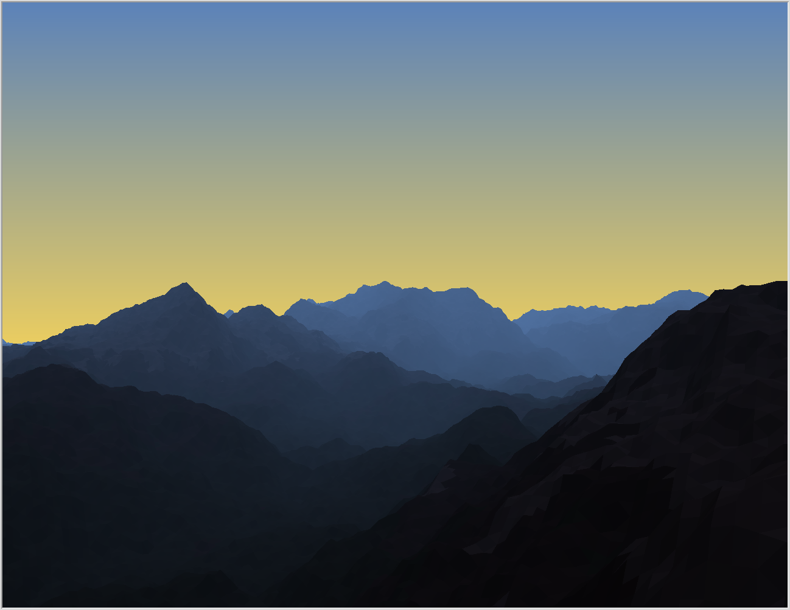
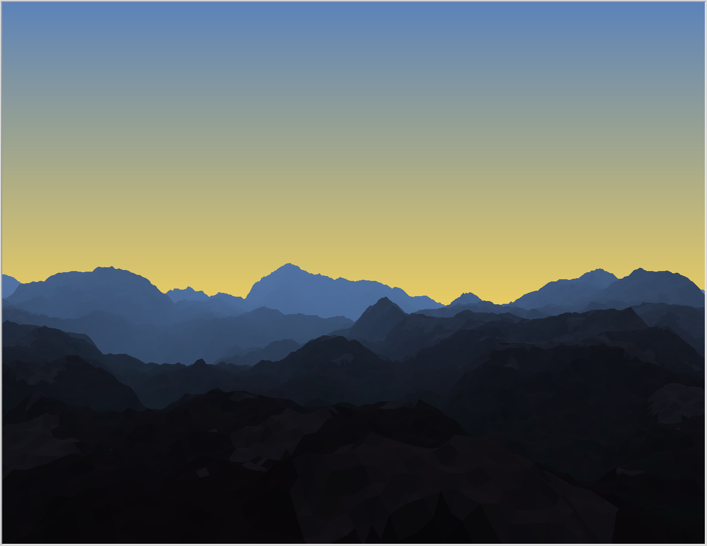
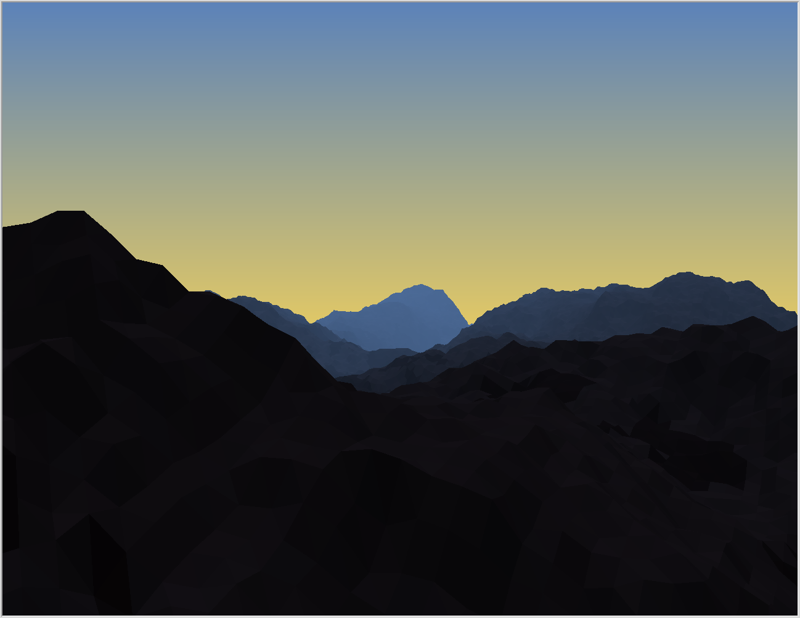
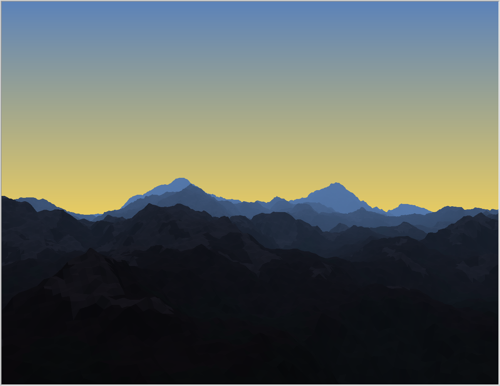
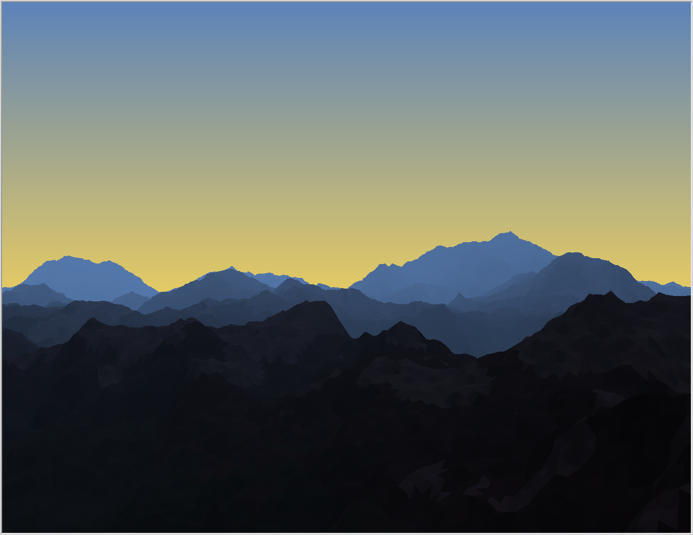
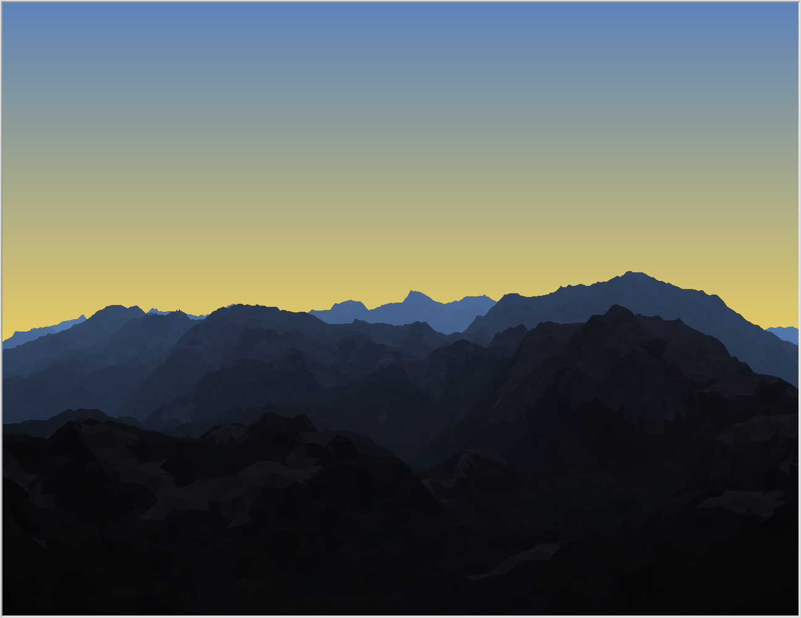
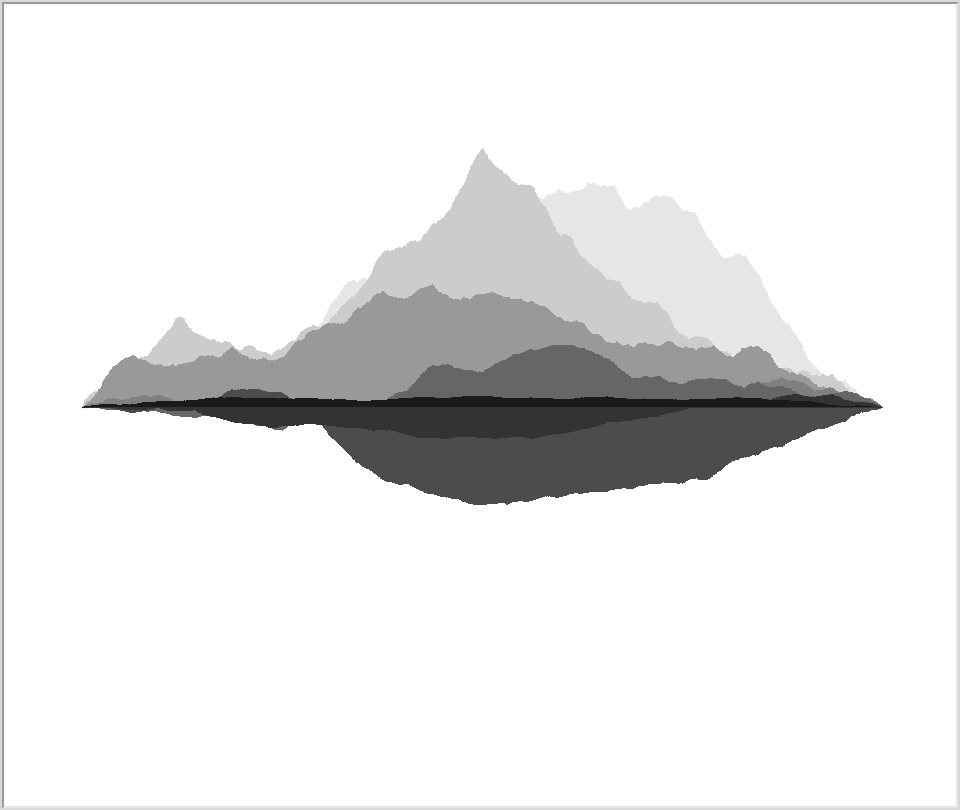

The task for the CS1 art show was to create an image using recursion and the [`turtle` graphics module](https://docs.python.org/3/library/turtle.html). My submission ([`poly3d.py`](poly3d.py)) draws a mountain range at dawn or dusk, shown above. The terrain heightmap is generated by recursively subdividing a triangle using a midpoint displacement algorithm. The resulting triangles in 3D space are then projected onto the 2D canvas, shaded according to a directional light and simulated atmospheric fog, sorted by Z depth, and finally drawn. The sky background is just a linear gradient between two colors.

`poly3d.py` is a standalone script with no dependencies other than standard Python 3.7 modules. (You may need to install Tkinter for the `turtle` graphics to work, however.) Without any arguments, it produces the above image and exports it to `./output.eps`. Supply the `--fast` flag (*very* much recommended) to bypass a bunch of the `turtle` overhead and draw directly to the underlying Tkinter canvas. Pass the `--help` flag to see other command-line options.

Big thanks to Lori for all the artistic help!


# Sample outputs with different random seeds

Generate these yourself by running:

```$ python3 poly3d.py --fast --random-color-offset --random-terrain```

(You can also add `--no-export` if you don't care about saving the result to an `.eps` file.)












# What's that `art.py` file?

The [`art.py`](art.py) file just contains some of my initial prototyping of midpoint displacement in 2D. It creates images like this:


